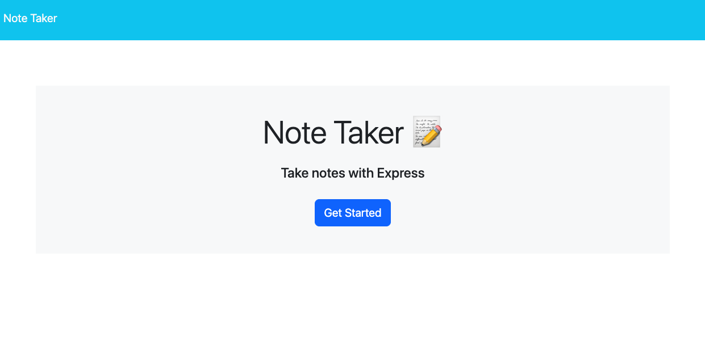
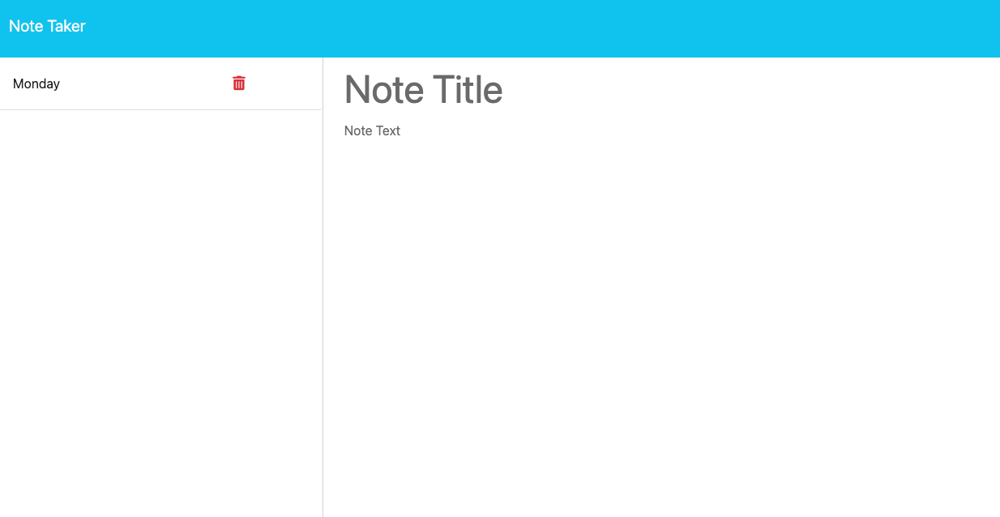

# 11 Note-Taking Application for Everyone  [](https://opensource.org/licenses/MIT)

## User Story

```
AS AN everyday Joe
I WANT to be able to write and save notes
SO THAT I can organize my thoughts and keep track of tasks I need to complete
```

## Description

This note-taking application allows users to save notes to a page for online task/reminder organization.

This friendly, easy-to-use app is a great tool for anyone to simply write, log, and store multiple to-do's, tasks, or reminders. 

GitHub repo link: https://github.com/dahfefe/11-note-taking-app

## Motivation
  
To enable the everyday user to have a simple, online tool where they can write, log with delete functionality, and organize needed notes throughout their day/week. 

## What I Learned
  
I became better familiarized with API routing in addition to storing user input data onto a JSON file that acts as a database storage for user input. 

## Table of Contents

- [Usage](#usage)
- [License](#license)
- [Features](#features)
- [How to Contribute](#contributing)
- [Any Questions?](#questions)

## Usage

To write, store, and delete notes (containing both a title and text section). 

## Screenshot 

Iniitial home landing page:



Page with note-taking application: 



## License [](https://opensource.org/licenses/MIT)

This project is licensed under the [MIT License](https://opensource.org/license/mit). You can find the license details in the LICENSE file included in this repository.

## Features
  
Dependency: [Express package](https://www.npmjs.com/package/express)

## Contributing

There are many ways in which you can participate in this project, for example:

* [Submit bugs and feature requests](https://github.com/dahfefe/11-note-taking-app/issues), and help us verify as they are checked in
* Review [source code changes](https://github.com/dahfefe/11-note-taking-app/pulls)
* Review the [documentation](https://github.com/microsoft/vscode-docs) and make pull requests for anything from typos to additional and new content

## Questions
  
Link to My GitHub: https://github.com/dahfefe

If you should have any questions, you can contact me at the following email address: fsmunozteng@gmail.com

